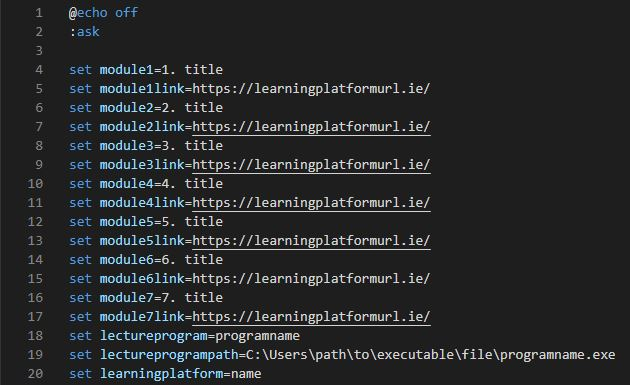
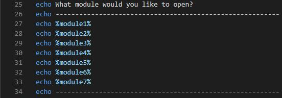
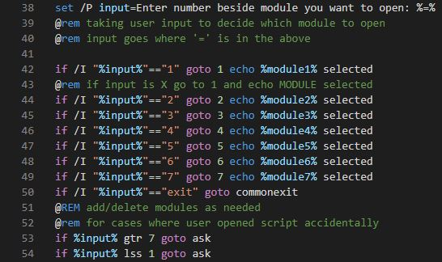
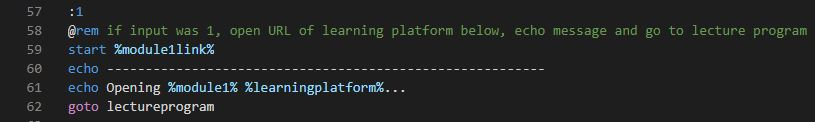
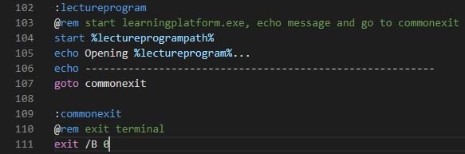

# gotocollege
Bash script for students that runs the executable file of the online lecture program that their college/school uses and opens the corresponding page on the learning platform for the lecture depending on the numerical input given. 

Created for students to quickly access online lectures and resources during an online learning period.

Script developed with Bash.

## To Run
Clone project and execute gotocollege.bat

## Code
Variables set so any user can add their own modules, module links, lecture program, path to lecture program and learning platform.

User then asked what module they would like to open, deciding, in this case, with a number between 1 and 7.

User input to decide which module to open. Goes to corresponding code depending on input. Input goes where '=' is in the snippet. Validation added for chars other than numbers 1-7 inclusive being entered.

If input was 1, open URL of corresponding learning platform web page, and go to lecture program.

Open the lecture program and exit the script.

